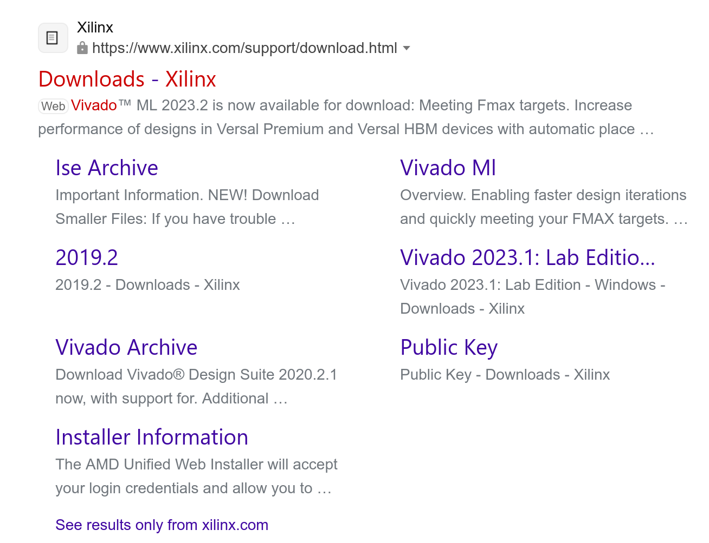
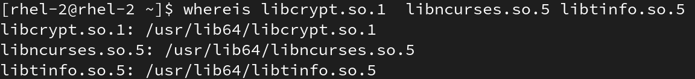
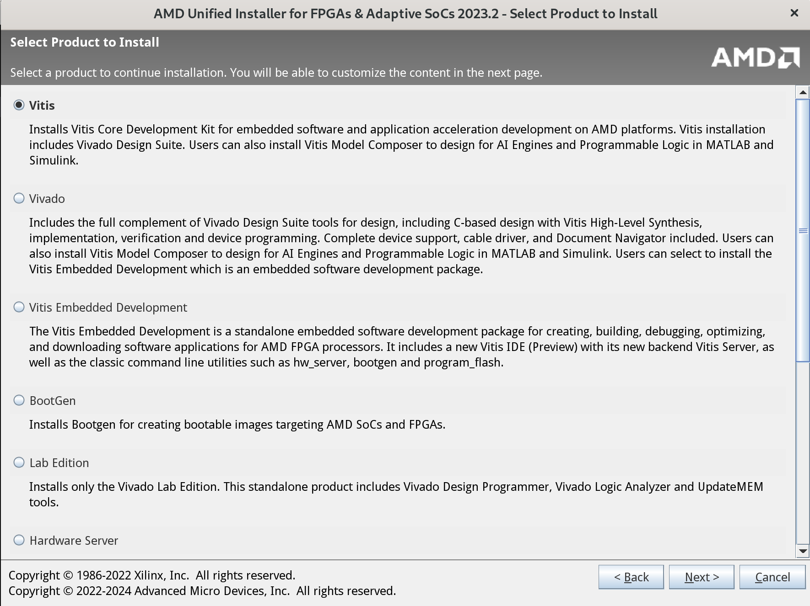
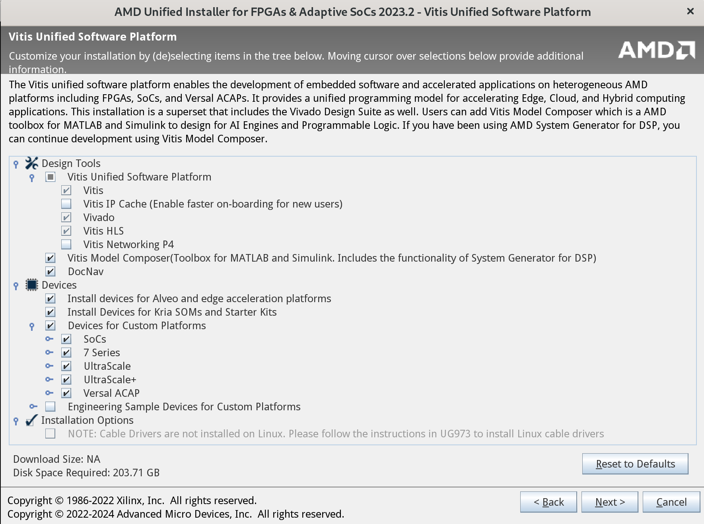

# FPGA IDE

时间: 2024.03.10

## 选择IDE

- Vitis: 包含Vitis Unified IDE、Vitis HLS、Vivado、Documentation Navigator等
- Vivado: 包含Vitis HLS、Vivado、Documentation Navigator等
- Vitis Unified IDE: Vitis应用开发，官方安装使用文档（UG1553）
- Vitis HLS: 高层综合开发，官方安装使用文档（UG1399）
- Vivado: 传统FPGA开发，官方安装使用文档（UG910）
- Documentation Navigator: 本地官方文档，官方文档亦可在浏览器按编号（如UG1553）搜索浏览

## 下载安装包

在浏览器搜索 "xilinx vivado download" ，进入如下图所示的网页。"Web Installer"在安装时需要联网，边下载边安装。"TAR/GZIP"结尾的为压缩包，下载体积较大，下载完成后解压安装。


## 安装

### 注意事项

1. 截至到当前，vivado安装依赖libcrypt.so.1、libncurses.so.5和libtinfo.so.5，需要运行如下命令查看当前系统是否具有链接库文件。

   ```bash
   whereis libcrypt.so.1 libncurses.so.5 libtinfo.so.5
   ```

   

   如果没有:

   - ubuntu(debian系)，使用apt-file命令搜索提供链接库的包

     ```bash
     apt-file search filename
     ```

   - rhel(fedora系)，使用dnf命令搜索
  
     ```bash
     dnf provides filename
     ```

### 进行安装

以压缩包为例

1. 运行解压后文件中的xsetup来进行安装

   ```bash
   [rhel-2@rhel-2 ~]$ ./Documents/FPGAs_AdaptiveSoCs_Unified_2023.2_1013_2256/xsetup
   ```

2. 如图所示，可选择"vitis"和"vivado"
  

3. 如果所示，可保持默认或者根据需要选择。
   

4. 最后，选择安装位置（注意磁盘容量）

## 安装后操作

对于Vitis，安装完毕后，根据官方文档，还需进行如下操作：

```bash
[rhel-2@rhel-2 ~]$ cd ./xilinx/Vitis/2023.2/scripts/
[rhel-2@rhel-2 scripts]$ sudo ./installLibs.sh
```
