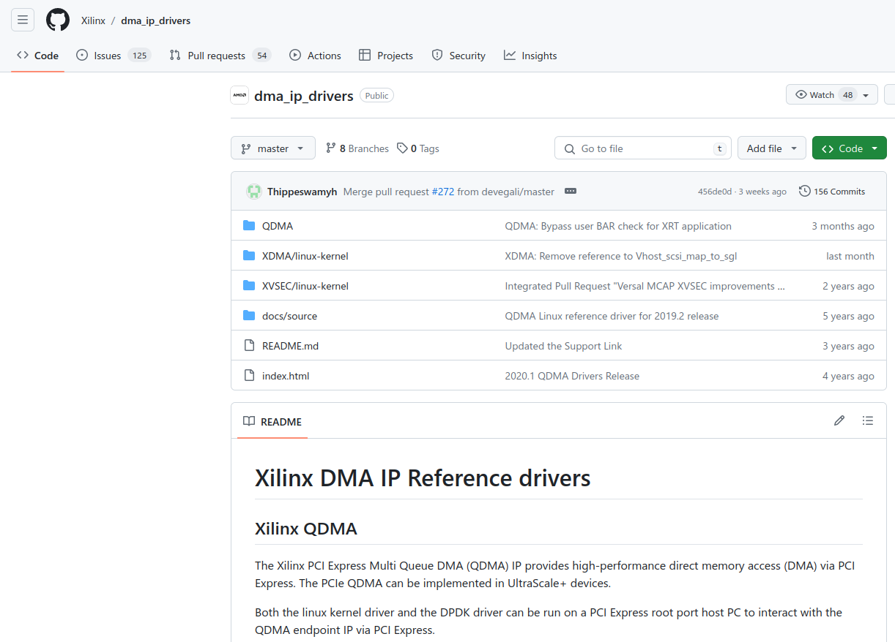
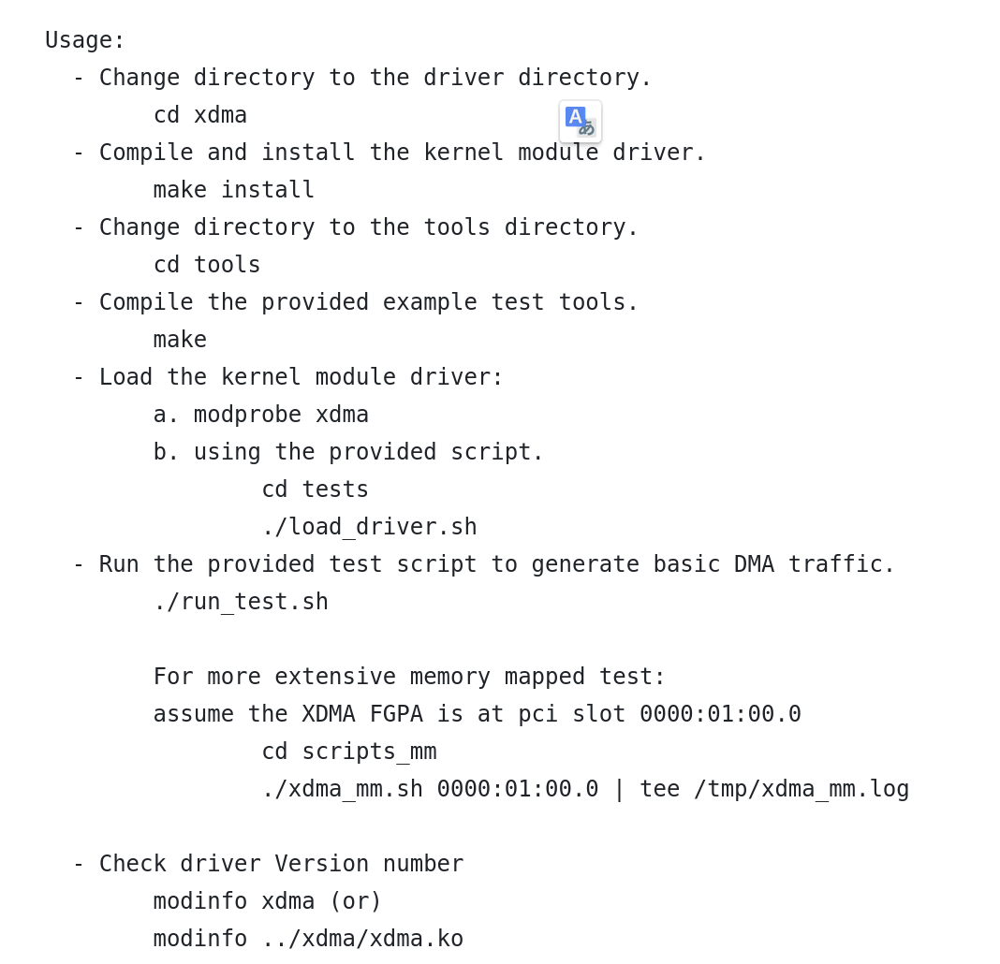

# XDMA

XDMA用于FPGA和主机之间通过PCIE传输数据

## Download

[xdma github](https://github.com/Xilinx/dma_ip_drivers)如下所示：

## Build

在dma_ip_drivers/XDMA/linux-kernel下有一个readme.txt，按照文件教程build  

### Issues

1. 必须关闭主板的安全启动
2. "Load the kernel module driver"后续操作需要FPGA中有bit流烧入，必须通过vivado把bit文件烧入到FPGA，然后重启主机，再执行"Load the kernel module driver"后续操作
3. 只要load_driver.sh正常运行就表示安装成功了，此时/dev文件夹下会有以"xdma"开头的设备文件。后续操作可以不用执行
4. 建议稍微了解make命令，在"make install" "make" 不成功，再次执行之前，建议首先执行"make clean"
5. 执行"make install"时可能会遇到各种gcc错误，建议去github仓库的issue中搜索，一定至少要把搜索栏的"is:open"删除
