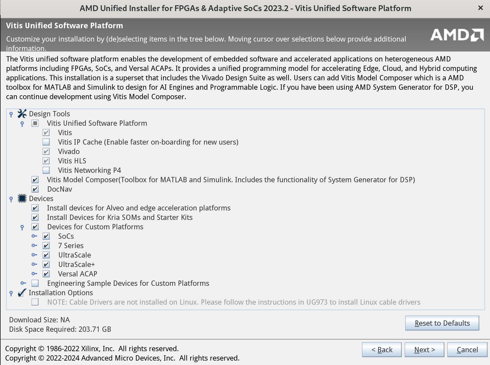
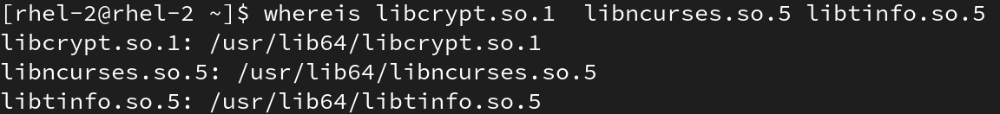

# FPGA IDE

FPGA IDE 安装

## 下载安装包

在浏览器搜索 "xilinx vivado download" ，进入如下图所示的网页。"Web Installer"在安装时需要联网，边下载边安装。"TAR/GZIP"结尾的为压缩包，下载体积较大，下载完成后解压安装。


## 安装

以压缩包为例

1. 运行解压后文件中的xsetup来进行安装

   ```bash
   [rhel-2@rhel-2 ~]$ ./Documents/FPGAs_AdaptiveSoCs_Unified_2023.2_1013_2256/xsetup
   ```

2. 如图所示，可选择"Vitis"和"Vivado"。2023.2中，"Vivado ML Standard"的devices中不再包含（VCU118），只能选择"Vivado ML Enterprise"或者"Vitis"，"Vivado ML Enterprise"需要许可证(许可证问师兄要)

   

3. 如果所示，可保持默认或者根据需要选择

   

4. 选择安装位置（注意磁盘容量）

5. 对于Vitis，安装完毕后，根据官方文档，还需进行如下操作安装需要的库：

   ```bash
   [rhel-2@rhel-2 ~]$ cd ./xilinx/Vitis/2023.2/scripts/
   [rhel-2@rhel-2 scripts]$ sudo ./installLibs.sh
   ```

6. 对于Vivado，需要安装driver

   ```bash
   ubuntu-1@ubuntu-1:$ cd xilinx/Vivado/2023.2/data/xicom/cable_drivers/lin64/install_script/install_drivers/
   ubuntu-1@ubuntu-1:$ sudo ./install_drivers
   ubuntu-1@ubuntu-1:$ sudo ./install_digilent.sh
   ```

## Issue

1. 在ubuntu上安装vivado2023.2时，一直卡在最后一步：generating installed device list

   Vivado2023.2安装依赖libcrypt.so.1、libncurses.so.5和libtinfo.so.5，需要运行如下命令查看当前系统是否具有链接库文件。

   ```bash
   whereis libcrypt.so.1 libncurses.so.5 libtinfo.so.5
   ```

   

   如果没有:

   - ubuntu(debian系)，使用apt-file命令搜索提供链接库的包(libcrypt.so.1、libncurses.so.5和libtinfo.so.5是libtinfo5 libncurses5两个包)

     ```bash
     sudo apt-file update
     sudo apt-file search libcrypt.so.1
     ```

   - rhel(fedora系)，使用dnf命令搜索
  
     ```bash
     sudo dnf update
     sudo dnf provides */libcrypt.so.1
     ```
