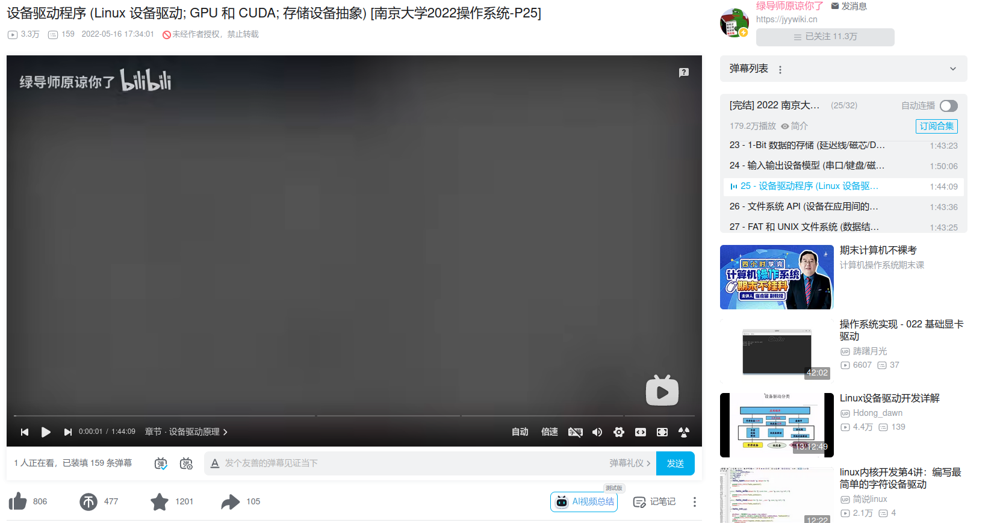

# LEARN XDMA

使用xdma需要了解axi协议、MMIO（Memory-Mapped I/O）、linux驱动编程等

## AXI

- [Xilinx 论坛](https://support.xilinx.com/s/article/1074583?language=zh_CN)

  

- [ARM 官方文档](https://developer.arm.com/documentation/102202/0300/AXI-protocol-overview)

  

## MMIO

- [PCIE 讲解](https://ctf.re/windows/kernel/pcie/tutorial/2023/02/14/pcie-part-1/)

  

## Linux驱动

- [Linux驱动设备讲解](https://www.bilibili.com/video/BV17r4y1b7bn)

  
